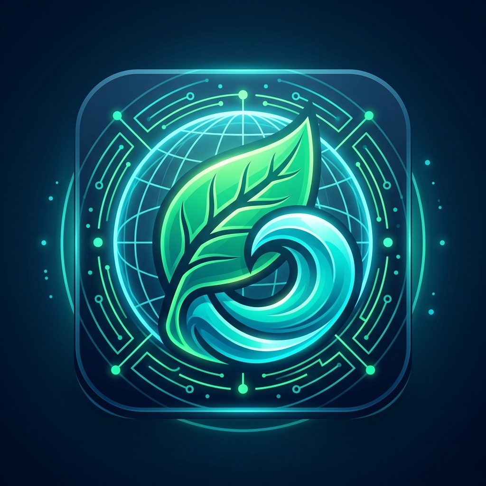
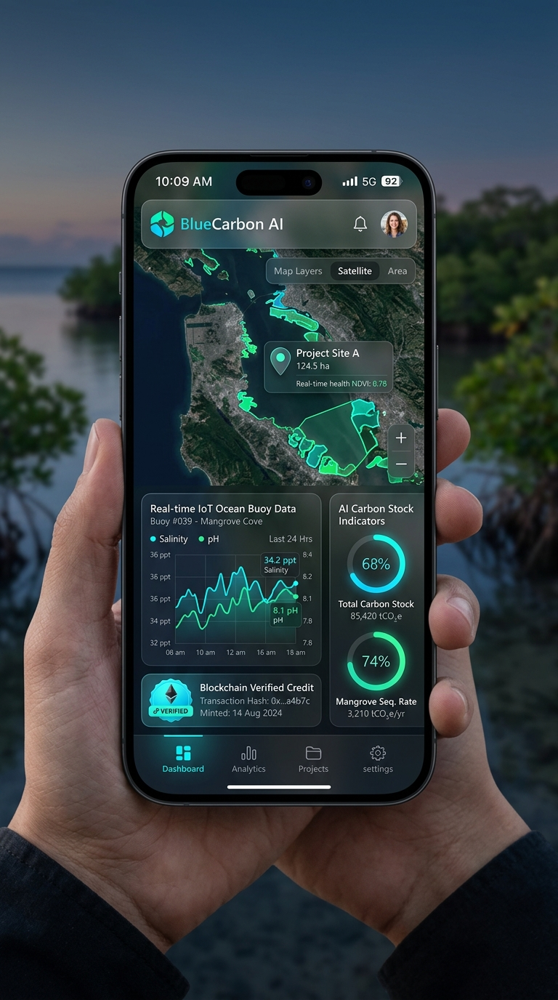

<div align="center">

  

  # 🌊 BlueCarbon AI
  ### **Blockchain-Backed Coastal Blue Carbon Registry & Real-Time Digital Twin MRV Platform**

  [](file:///c:/Users/MITHESH%20D/Downloads/Blue%20carbon%20SIH/SIH25038_BlueCarbon_Idea_Submission.pdf)
  [](file:///c:/Users/MITHESH%20D/Downloads/Blue%20carbon%20SIH/BlueCarbon_AI_Platform_Complete_Documentation.pdf)
  [](public/datasets/indian_blue_carbon_master.json)
  [](BlueCarbon_AI.apk)
  [](LICENSE)

  <p align="center">
    <a href="#-quick-start"><b>Quick Start</b></a> •
    <a href="#-visual-showcase"><b>Screenshots</b></a> •
    <a href="#-core-modules--features"><b>Core Modules</b></a> •
    <a href="#-system-architecture"><b>Architecture</b></a> •
    <a href="#-coastal-blue-carbon-hotspots"><b>Hotspots</b></a> •
    <a href="#-documentation--manual"><b>Documentation</b></a>
  </p>

</div>

---

## 📌 Executive Overview

**BlueCarbon AI** is a next-generation Measurement, Reporting, and Verification (**MRV**) ecosystem built for coastal blue carbon reserves (*mangroves, submerged seagrass meadows, tidal salt marshes*) and expandable to inland terrestrial forests.

It bridges Earth Observation satellite remote sensing, ocean IoT sensor buoys, Explainable AI (SHAP) biomass stock prediction, and Web3 cryptographic evidence ledgering to eliminate double-counting fraud and enable transparent credit issuance for the **Ministry of Earth Sciences (MoES)** and government verifiers.

---

## 📱 Visual Showcase

<div align="center">
  <table>
    <tr>
      <td align="center" width="40%">
        <br/>
        <b>🎨 3D Vector App Icon</b>
      </td>
      <td align="center" width="60%">
        <br/>
        <b>📱 Android Mobile UI/UX Interface</b>
      </td>
    </tr>
  </table>
</div>

---

## ⚡ Quick Start

### 1. 🌐 Web Application (One-Click Launch)
Simply double-click the launcher script in the root directory:
```cmd
START_APP.bat
```
> **Automatic Launcher Features:**
> - Auto-frees port 3000 if occupied by stale processes.
> - Automatically opens your default browser at `http://localhost:3000`.
> - Launches unified Node Express REST backend + React Single Page Application.

### 2. 📲 Standalone Android Mobile App (100% Offline Capable)
Install the compiled Android APK on any smartphone:
- **📦 Download APK**: **[`BlueCarbon_AI.apk`](BlueCarbon_AI.apk)** *(5.20 MB - Workspace Root)*
- **Airplane Mode Supported**: All maps, datasets, AI carbon models, and SHA-256 certificate generators are natively bundled inside the APK assets for 100% offline execution.

---

## 🛠️ Core Modules & Features

<details open>
<summary><b>🗺️ 1. GIS Digital Twin Satellite Workspace</b></summary>
<br/>

- **Esri World Imagery Satellite Engine**: High-res satellite tiles centered on exact GPS coordinates of Indian blue carbon reserves.
- **4 Spectral Layer Switchers**:
  - `True Color`: Natural satellite RGB view.
  - `NDVI (Canopy Health)`: Multispectral vegetation index ($\frac{\text{NIR}-\text{RED}}{\text{NIR}+\text{RED}}$) measuring leaf density.
  - `NDWI (Water Content)`: Moisture saturation and surface water extent.
  - `LiDAR Height Mesh`: Visualizes 3D vertical canopy profile height.
- **Draw Custom ROI Boundary Tool**: Calculates custom polygon hectarage, estimated carbon stock, average NDVI, and reversal risk score.

</details>

<details open>
<summary><b>📡 2. Marine IoT Ocean Buoy Telemetry Stream</b></summary>
<br/>

- **6 Live Sensor Gauges**: Salinity (ppt), Soil Organic Carbon (SOC %), Water Temperature (°C), Sediment pH, Sea Level Anomaly (mm), Dissolved Oxygen (mg/L).
- **30s Real-Time Stream LineChart**: Live Recharts graph updating every 2.5 seconds.
- **Automated Anomaly Filter**: Automatically flags thermal spikes (>31°C), hypersalinity (>40 ppt), or SOC drops (<2.5%).

</details>

<details open>
<summary><b>🧠 3. AI Carbon Stock & Reversal Risk Engine</b></summary>
<br/>

- **IPCC Tier 3 Biomass Pool Breakdown**: Horizontal BarChart rendering Above-Ground Biomass (AGB), Below-Ground Biomass (BGB), and Soil Organic Carbon (SOC 1m depth) in t/ha.
- **SHAP Explainable AI (XAI)**: Feature attribution quantifying coastal erosion, canopy trend, storm surge, and soil salinity risk drivers.
- **Multi-Year Sequestration Forecast**: 2020–2026 carbon stock growth trajectory area chart.

</details>

<details open>
<summary><b>🌪️ 4. Environmental Stress & Disaster Simulator</b></summary>
<br/>

- **4 Interactive Hazard Scenarios**:
  - *Category 4 Super Cyclone* (185 km/h winds, `EMERGENCY_FREEZE_CYCLONE_DAMAGE`)
  - *Coastal Oil Spill* (smothers pneumatophore roots, `ALERT_POLLUTION_SOIL_TOXICITY`)
  - *Illegal Deforestation* (aquaculture pond clearing, `CRITICAL_FRAUD_ILLEGAL_CLEARING`)
  - *Marine Heatwave* (sea temp >33.5°C, `WARNING_THERMAL_BLEACHING_RISK`)
- **Safety Response**: Calculates carbon loss, degrades satellite maps, and emits smart contract freeze events.

</details>

<details open>
<summary><b>🔗 5. Web3 Cryptographic Evidence Ledger</b></summary>
<br/>

- **SHA-256 Hashes & Merkle Trees**: Computes 256-bit evidence payload hash and Merkle root proof (height 4, 4096 leaves) anchored to Polygon POS.
- **Searchable Audit Log Table**: Filter by block number, transaction hash, signer, or event type.
- **Printable MRV Certificate Modal**: Confetti animation, QR code verification, and PDF export (`window.print()`).

</details>

<details open>
<summary><b>🏛️ 6. MoES Verifier Workflow Portal</b></summary>
<br/>

- **Temporal Satellite Differencing**: Side-by-side comparison of 2020 Baseline vs 2026 Present satellite imagery with active growth calculation (+Ha) and vegetation expansion %.
- **AI Fraud Checks**: Verifies double-counting prevention against Verra & Gold Standard registries.
- **Auditor Sign-Off**: Independent `Approve & Mint Carbon Credits` and `Reject Claim` buttons with auditor notes saved per site.

</details>

---

## 🏗️ System Architecture

```text
 ┌────────────────────────┐      ┌────────────────────────┐
 │   Sentinel-2 / ISRO    │      │  Marine IoT Buoy Nodes │
 │  Multispectral Sat     │      │   (Salinity, Temp, SOC)│
 └───────────┬────────────┘      └───────────┬────────────┘
             │                               │
             ▼                               ▼
 ┌────────────────────────────────────────────────────────┐
 │         BlueCarbon AI Core Processing Engine           │
 │  • IPCC Tier-3 Biomass Pool Calculator (AGB/BGB/SOC)   │
 │  • SHAP Explainable AI Reversal Risk Engine (0-100%)   │
 └───────────────────────────┬────────────────────────────┘
                             │
                             ▼
 ┌────────────────────────────────────────────────────────┐
 │            Web3 Cryptographic Proof Engine             │
 │  • SHA-256 Payload Hash  • Merkle Tree Root (Height 4)  │
 └───────────────────────────┬────────────────────────────┘
                             │
              ┌──────────────┴──────────────┐
              ▼                             ▼
 ┌────────────────────────┐    ┌────────────────────────┐
 │  MoES Auditor Portal   │    │ Polygon POS Blockchain │
 │  (Approve & Mint)      │    │ (ERC-1155 Credit Log)  │
 └────────────────────────┘    └────────────────────────┘
```

---

## 🌴 Coastal Blue Carbon Hotspots Tracked

| Hotspot Name | State | Ecosystem Type | Area (Ha) | Total Baseline Stock | Status |
| :--- | :--- | :--- | :--- | :--- | :--- |
| **Sundarbans Biosphere Reserve** | West Bengal | Dense Mangrove Forest | 42,600 Ha | 1,745,200 tCO₂e | `VERIFIED` |
| **Pichavaram Mangrove Wetland** | Tamil Nadu | Estuarine Mangrove Complex | 1,100 Ha | 432,000 tCO₂e | `VERIFIED` |
| **Bhitarkanika National Park** | Odisha | Tidal Deltaic Mangrove | 14,500 Ha | 642,000 tCO₂e | `VERIFIED` |
| **Gulf of Kutch Marine Sanctuary** | Gujarat | Arid / Hypersaline Mangrove | 18,200 Ha | 485,000 tCO₂e | `PENDING` |
| **Chilika Lake Seagrass Ecosystem** | Odisha | Submerged Seagrass Meadow | 12,500 Ha | 395,000 tCO₂e | `VERIFIED` |

---

## 💻 Tech Stack & Dependencies

| Layer | Technologies Used |
| :--- | :--- |
| **Frontend UI** | React 18, TailwindCSS, Lucide Icons, Canvas Confetti, Recharts |
| **Mapping & GIS** | Leaflet.js, Esri World Imagery, Carto Voyager Labels |
| **Backend REST API** | Node.js, Express, CORS, Static Middleware |
| **Mobile Native** | Capacitor 7 (`@capacitor/android`), Java 21, Gradle |
| **Cryptography** | CryptoJS (SHA-256), Merkle Tree Engine |
| **PDF Generation** | Python 3, ReportLab, Pillow |

---

## 💻 Developer Installation & Commands

```bash
# 1. Clone repository
git clone https://github.com/your-username/blue-carbon-sih.git
cd blue-carbon-sih

# 2. Install dependencies
npm install

# 3. Launch Development Server (Port 4000 with API Proxy)
npm run dev

# 4. Build Production Bundle
npm run build

# 5. Launch Production Server (Port 3000)
npm start

# 6. Rebuild Mobile Android APK
npx cap sync android
cd android
.\gradlew.bat assembleDebug
```

---

## 📄 Documentation Manuals

- **[BlueCarbon_AI_Platform_Complete_Documentation.pdf](BlueCarbon_AI_Platform_Complete_Documentation.pdf)** — Full 4-page technical manual and complete term glossary.
- **[SIH25038_BlueCarbon_Idea_Submission.pdf](SIH25038_BlueCarbon_Idea_Submission.pdf)** — Hackathon slide presentation.

---

<div align="center">

  <b>Made with ❤️ for Smart India Hackathon (SIH 2025) & Ministry of Earth Sciences (MoES)</b>

</div>
